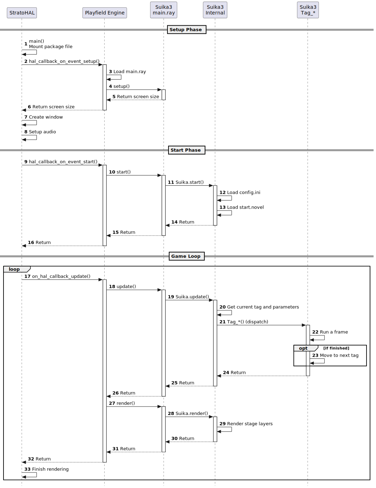

Дизайн Suika3
=============

## Модель слоистых компонентов

Suika3 не является монолитной системой: она разделена на небольшие библиотеки и части, которые образуют общую иерархическую структуру, где слои располагаются друг над другом.

- Каждый слой реализует только одну возможность.
- Каждый слой предоставляет публичный API языка C слою, расположенному на один уровень выше.
- Каждый слой может использовать только публичный API языка C, предоставленный слоем на один уровень ниже.

В Suika3 такая структура называется "Layered Component Model".

Преимущество такого подхода в том, что классы в объектно-ориентированных языках, таких как C++, должны учитывать сложные зависимости "многие ко многим", тогда как в Layered Component Model нужно рассматривать только связи со слоями на один уровень выше и ниже. Это упрощает проектирование, реализацию, изменение и расширение.
Полноценный игровой движок представляет собой сложное и большое программное обеспечение, но если собирать его из простых компонентов со связями "один к одному", систему в целом становится проще строить, что повышает переносимость.

Переносимость повышается потому, что нижний слой является "hardware abstraction layer", который скрывает различия между ОС, а расположенные выше слои можно проектировать и реализовывать без учета этих различий.

```
+-----------------------------------+
| VN Engine (Suika3)                |
+-----------------------------------+
| 2D Game Engine (Playfield Engine) |
+-----------------------------------+
| Scripting Language (NoctLang)     |
+-----------------------------------+
| Hardware Abstraction Layer        |
| (StratoHAL)                       |
+-----------------------------------+
```

## Boot and Execution Sequence



- StratoHAL: `main()` is called.
- StratoHAL: Mount the package file.
- StratoHAL: Calls `hal_callback_on_event_setup()` in `Playfield Engine` tp determine the screen size.
    - Playfield Engine: `hal_callback_on_event_setup()` is called.
    - Playfield Engine: Loads `main.ray`.
    - Playfield Engine: Calls `setup()` in the `main.ray`.
        - Suika3 Game: `setup()` is called.
        - Suika3 Game: Returns the screen size.
    - Playfield Engine: Returns the screen size.
- StratoHAL: Now knows the screen size.
- StratoHAL: Creates the window.
- StratoHAL: Sets up audio.
- StratoHAL: Calls `hal_callback_on_event_start()` in `Playfield Engine`.
    - Playfield Engine: `hal_callback_on_event_start()` is called.
    - Playfield Engine: Calls `start()` in the `main.ray`.
        - Suika3 Game: `start()` is called.
        - Suika3 Game: Calls `Suika.start()`.
            - Suika3 Internal: `Suika.start()` is called.
            - Suika3 Internal: Load `config.ini`.
            - Suika3 Internal: Load `start.novel`.
            - Suika3 Internal: Returns.
        - Suika3 Game: Returns.
    - Playfield Engine: Returns.
- StratoHAL: Game Loop:
    - StratoHAL: Calls `on_hal_callback_update()` in `Playfield Engine`.
        - Playfield Engine: `on_hal_callback_update()` is called.
		- Playfield Engine: Calls `update()` in the `main.ray`.
            - Suika3 Game: `update()` is called.
            - Suika3 Game: Calls `Suika.update()`.
                - Suika3 Internal: `Suika.update()` is called.
                - Suika3 Internal: Get the current tag and its parameters.
                - Suika3 Internal: Calls `Tag_*()` correnponding to the current tag.
                    - Tag_*: Run a frame.
                    - Tag_*: Moves to the next tag if finished.
                    - Tag_*: Returns.
            - Suika3 Game: Returns.
		- Playfield Engine: Calls `render()` in the `main.ray`.
            - Suika3: `render()` is called.
            - Suika3: Calls `Suika.render()`.
                - Suika3 Internal: Renders the stage layers.
                - Suika3 Internal: Returns.
            - User Game: Returns.
    - StratoHAL: Finish rendering.
    - StratoHAL: Go back to the beginning of the loop.
